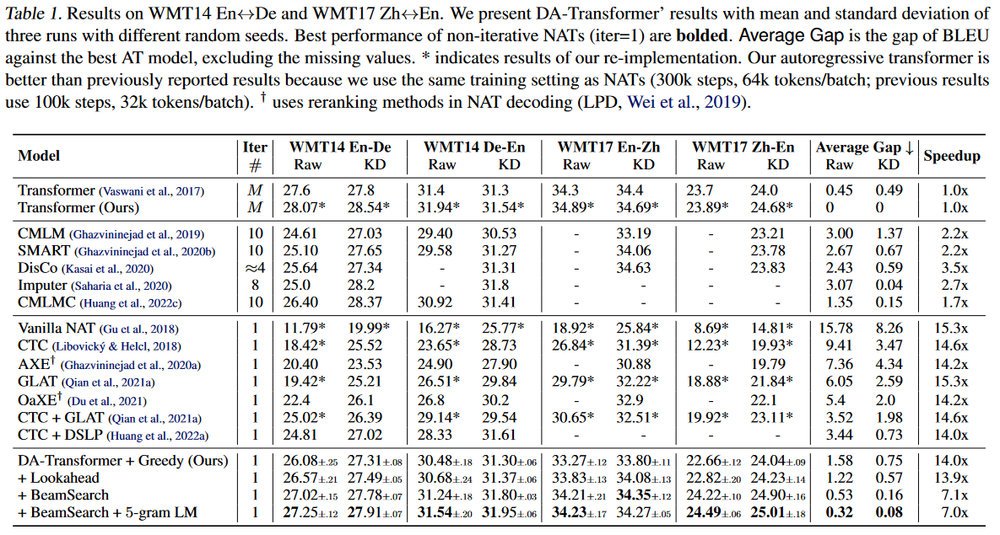
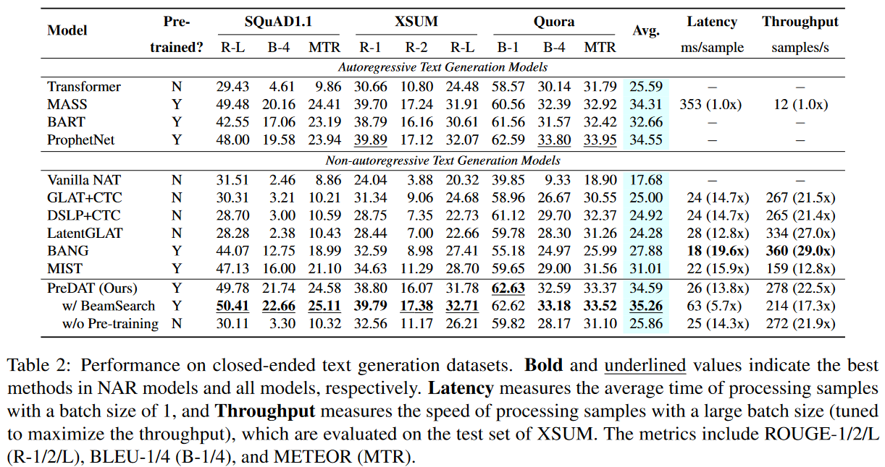
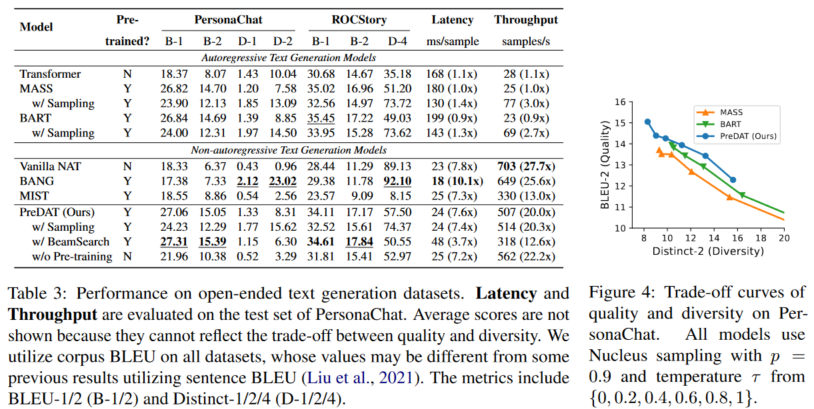

# DA-Transformer

Directed Acyclic Transformer (DA-Transformer) is a non-autoregressive sequence-to-sequence model designed for parallel text generation. This repository contains the implementation of DA-Transformer, as well as pre-trained checkpoints.

**Abstract**: Unlike traditional sequence-to-sequence models that generate output tokens one at a time, DA-Transformer predicts a Directed Acyclic Graph (DAG) that represents all possible outputs simultaneously. Each path in the DAG corresponds to a specific output sequence, which enables fast and diverse text generation in a non-autoregressive fashion.


**Practical Advantages**:

* **Fast Generation**: DA-Transformer offers faster inference compared to autoregressive Transformers (with fairseq implementation), with a reduction in latency by 7~14x and an increase in throughput by ~20x.
* **High Quality**: DA-Transformer performs competitively with autoregressive Transformers, even with pre-trained models like BART, in a variety of text generation tasks.
* **Easy Training**: DA-Transformer can be trained end-to-end without requiring knowledge distillation, making it simple and straightforward to train.

<details>
  <summary>Click Here for Performance on Machine Translation</summary>

  
</details>


<details>
  <summary>Click Here for Performance on Close-Ended Text Generation</summary>

  
</details>

<details>
  <summary>Click Here for Performance on Open-Ended Text Generation</summary>

  
</details>

**News(2023-4-11)**: We are excited to announce a new framework to train DA-Transformer and a pre-trained checkpoint on Wikipedia and BookCorpus. After fine-tuning, **DA-Transformer achieves outstanding results on various generation tasks**, including question generation, summarization, paraphrasing, dialog generation, and story generation, **surpassing the performance of some pre-trained autoregressive models**, such as [MASS](https://github.com/microsoft/MASS), [BART](https://github.com/facebookresearch/fairseq/blob/main/examples/bart/README.md), and [ProphetNet](https://github.com/microsoft/ProphetNet). We are currently working on a research paper and will release it soon. Stay tuned for updates!

**News(2022-5-23)**: We released the DA-Transformer code for machine translation. Update: This [version](https://github.com/thu-coai/DA-Transformer/tree/v1.0) is archived.

## Table of Contents

* [Overview](#overview)
* [Requirements & Installation](#requirements--installation)
* [Preparing Data](#preparing-data)
* [Training](#training)
  * [Examples](#examples)
  * [Up-sampling Strategies](#up-sampling-strategies)
  * [Speed Up with LightSeq](#speed-up-with-lightseq)
* [Decoding](#decoding)
  * [Averaging Checkpoints](#averaging-checkpoints)
  * [Greedy/Lookahead Decoding](#greedylookahead-decoding)
  * [Viterbi Decoding](#viterbi-decoding)
  * [Sampling](#sampling)
  * [BeamSearch](#beamsearch)
* [Evaluation Scripts](#evaluation-scripts)
* [Other Scripts](#other-scripts)
* [Released Checkpoints](#released-checkpoints)
* [FAQs](#faqs)
* [How to Cite](#how-to-cite)

## Overview

This repository is constructed using the codebase from  [``fairseq:5175fd``](https://github.com/pytorch/fairseq/tree/5175fd5c267adceec9445bf067597686e159e7e7). If you require information on the basic usage of fairseq, please refer to the [fairseq documentation](https://fairseq.readthedocs.io/en/latest/).

Here are some features of our implementation:

* Our implementation includes CUDA implementations (enabled by default) for training, which includes a dynamic programming algorithm and several other operations that improve training speed and reduce GPU memory usage. If you prefer not to use CUDA, we also provide modules implemented in PyTorch native operations.
* We support LightSeq, which can further boost training speed. (Note that the reported speedup in the paper does not use LightSeq.)
* We offer a multi-threaded C++ implementation for BeamSearch.
* We have modified the fairseq training script to allow more detailed batch manipulation to avoid OOM problems in training DA-Transformer. See ``--batch-split-by-src``  and ``--max-tokens-after-upsampling`` in the descriptions below.
* We have also modified the fairseq generation script to support **overlapped decoding**, which significantly speeds up decoding throughput by reducing GPU idle time through conducting beam search algorithm on multiple CPU processes. See ``fairseq-fastgenerate`` in the descriptions below.

### DA-Transformer files (fs_plugins)

```
fs_plugins
├── criterions
│   └── nat_dag_loss.py                   # DA-Transformer loss
├── custom_ops                            # Operations implementations and cuda kernels
│   ├── dag_best_alignment.cu
│   ├── logsoftmax_gather.cu
│   ├── dag_loss.cu
│   ├── dag_loss.py
│   └── dag_loss.cpp
├── models
│   ├── glat_decomposed_with_link.py      # A PyTorch implementation of DA-Transformer
│   ├── ls_glat_decomposed_with_link.py   # A lightseq implementation of DA-Transformer
│   └── ls_*                              # Other files for lightseq
├── tasks
│   ├── translation_dat_dict.py           # Customized dictionary implementation (add some special tokens)
│   ├── translation_dat_dataset.py        # Customized dataset (useful in pre-training)
│   ├── translation_dat_generator.py      # Customized generator
|   └── translation_dat.py                # Customized task
├── optimizer
│   └── ls_adam.py                        # Lightseq Adam
└── scripts
   ├── average_checkpoints.py             # Averaging checkpoints tricks
   ├── convert_fs_to_ls.py                # Converting fairseq checkpoint to fairseq checkpoint
   ├── convert_ls_to_fs.py                # Converting lightseq checkpoint to fairseq checkpoint
   └── extract_model_state.py             # Extracting model weights from a checkpoint
```

### Customized LightSeq for NAT

Our code repository incorporates [a customized  version of LightSeq](https://github.com/thu-coai/lightseq-nat/), with the following modifications:

* Implementation of a non-autoregressive decoder using the LightSeq autoregressive decoder as a base.
* Increased support for maximum length (currently set at 1024)
* Aligned parameters and model architectures with the Fairseq implementation, providing with a script for checkpoint conversion.

### BeamSearch on DAG

We have incorporated [dag_search](https://github.com/thu-coai/DAG-Search) into this repository, which implements the Beam Search algorithm on the DAG.

## Requirements & Installation

* Python >= 3.7
* Pytorch == 1.10.1 (tested with cuda == 10.2 or 11.3)
* gcc >= 7.0.0 (for compiling cuda operations. See FAQs if you want to use a lower gcc version)
* ``git clone --recurse-submodules https://github.com/thu-coai/DA-Transformer.git && pip install -e .``
* (Optional) Customized LightSeq for NAT (``cd lightseq && pip install -e .``)
* (Optional) BeamSearch algorithm for DA-Transformer (``cd dag_search && bash install.sh``)

## Preparing Data

We provide the datasets used in our papers.

| Dataset       | Task                  | Data                                                                                                                                                                                                                                                                                            | Source                                                                                                                                                                                                 |
|---------------|-----------------------|-------------------------------------------------------------------------------------------------------------------------------------------------------------------------------------------------------------------------------------------------------------------------------------------------|--------------------------------------------------------------------------------------------------------------------------------------------------------------------------------------------------------|
| WMT14 En<->De | Machine Translation   | [[Link]](https://cloud.tsinghua.edu.cn/d/e64621ab19c44e55a774/): including raw data and distilled data.                                                                                                                                                                                         | The cleaned raw data is from [Fairseq](https://github.com/facebookresearch/fairseq/tree/main/examples/nonautoregressive_translation). The distilled corpora are generated by a Transformer-big  model. |
| WMT17 Zh<->En | Machine Translation   | [[Link]](https://cloud.tsinghua.edu.cn/d/3aa30749bd03423ba315/): including raw data and distilled data.                                                                                                                                                                                         | The distilled corpora are generated by a Transformer-big model.                                                                                                                                        |
| SQuAD1.1      | Question Generation   | [[Training]](https://microsoft.github.io/glge/) [[Test]](https://drive.google.com/file/d/11lDXIG87dChIfukq3x2Wx4r5_duCRm_J/view?usp=sharing) [[Pre-processing script]](./examples/DA-Transformer/process_bert_uncased.py) [[Vocab]](https://cloud.tsinghua.edu.cn/f/32ab06d8f7c546569c87/?dl=1) | Provided by [GLGE](https://microsoft.github.io/glge/).                                                                                                                                                 |
| XSUM          | Summarization         | [[Training]](https://microsoft.github.io/glge/) [[Test]](https://drive.google.com/file/d/11lDXIG87dChIfukq3x2Wx4r5_duCRm_J/view?usp=sharing) [[Pre-processing script]](./examples/DA-Transformer/process_bert_uncased.py) [[Vocab]](https://cloud.tsinghua.edu.cn/f/32ab06d8f7c546569c87/?dl=1) | Provided by [GLGE](https://microsoft.github.io/glge/).                                                                                                                                                 |
| Quora         | Paraphrase Generation | [[Pre-processed Data]](https://cloud.tsinghua.edu.cn/f/de33381a2fdc4d16b1ec/?dl=1) [[Vocab]](https://cloud.tsinghua.edu.cn/f/32ab06d8f7c546569c87/?dl=1)                                                                                                                                        | Provided by [Quora](https://quoradata.quora.com/First-Quora-Dataset-Release-Question-Pairs) and [MIST](https://github.com/kongds/MIST).                                                                |
| PersonaChat   | Dialog Generation     | [[Training]](https://microsoft.github.io/glge/) [[Test]](https://drive.google.com/file/d/11lDXIG87dChIfukq3x2Wx4r5_duCRm_J/view?usp=sharing) [[Pre-processing script]](./examples/DA-Transformer/process_bert_uncased.py) [[Vocab]](https://cloud.tsinghua.edu.cn/f/32ab06d8f7c546569c87/?dl=1) | Provided by [GLGE](https://microsoft.github.io/glge/).                                                                                                                                                 |
| ROCStory      | Story Generation      | [[Pre-processed Data]](https://cloud.tsinghua.edu.cn/f/46388d8239c248b1a13c/?dl=1) [[Vocab]](https://cloud.tsinghua.edu.cn/f/32ab06d8f7c546569c87/?dl=1)                                                                                                                                        | Provided by [[Link]](https://www.cs.rochester.edu/nlp/rocstories/).                                                                                                                                    |

As the pre-training data size is too large, we only provide [pre-processing script](./examples/DA-Transformer/process_pretrain.py) and [pre-processed examples](./examples/DA-Transformer/pretrain_data_example). It can be applied to any unlabelled copora to construct the pre-training data.

Then, to generate the binarized data required for fairseq training, run the following script:

```bash
input_dir=path/to/raw_data        # directory of pre-processed text data
data_dir=path/to/binarized_data   # directory of the generated binarized data
src=src                            # source suffix
tgt=tgt                            # target suffix
fairseq-preprocess --source-lang ${src} --target-lang ${tgt} \
    --trainpref ${input_dir}/train --validpref ${input_dir}/valid --testpref ${input_dir}/test \
    --src-dict ${input_dir}/dict.${src}.txt --tgt-dict {input_dir}/dict.${tgt}.txt \
    --destdir ${data_dir} --workers 32 \
    --task translation_dat_task [--seg-tokens 32]

# seg-tokens should be set to 32 when you use pre-trained models
```

## Training

You can use ``fairseq-train`` to train a DA-Transformer. A basic example is shown as follows:

```bash
data_dir=/path/to/binarized/data/dir
checkpoint_dir=/path/to/checkpoint/dir
tensorboard_dir=/path/to/tensorboard/dir
pretrained_model=/path/to/model.bin

fairseq-train ${data_dir}  \
    \
    `# loading DA-Transformer plugins` \
    --user-dir fs_plugins \
    \
    `# DA-Transformer Task Configs` \
    --task translation_dat_task \
    --upsample-base source --upsample-scale 8 \
    [--seg-tokens 32] [--filter-max-length 512:128] [--filter-ratio 2] \
    \
    `# DA-Transformer Architecture Configs` \
    --arch glat_decomposed_link_base \
    --links-feature feature:position [--segment-embedding] \
    --max-source-positions 128 --max-target-positions 1024 [--truncate-source] \
    --encoder-learned-pos --decoder-learned-pos \
    --share-all-embeddings --activation-fn gelu --apply-bert-init \
    [--load-pretrained-model ${pretrained_model}] \
    \
    `# DA-Transformer Decoding Configs (See more in the decoding section)` \
    --decode-strategy lookahead --decode-upsample-scale 8.0 \
    \
    `# DA-Transformer Criterion Configs` \
    --criterion nat_dag_loss \
    --length-loss-factor 0 --max-transition-length 99999 \
    --glat-p 0.5:0.1@200k --glance-strategy number-random \
    [--use-pretrain-loss] [--no-force-emit] \
    [--torch-dag-loss] [--torch-best-alignment-loss] [--torch-dag-logsoftmax-gather] \
    \
    `# Optimizer & Regularizer Configs` \
    --optimizer adam --adam-betas '(0.9,0.999)' --fp16 \
    --label-smoothing 0.0 --weight-decay 0.01 --dropout 0.1 \
    --lr-scheduler inverse_sqrt  --warmup-updates 10000   \
    --clip-norm 0.1 --lr 0.0005 --warmup-init-lr '1e-07' --stop-min-lr '1e-09' \
    \
    `# Training Configs` \
    --max-tokens 4096  --max-tokens-valid 4096 --update-freq 2 \
    [--max-tokens-after-upsample] [--batch-split-by-src 32767] \
    [--max-encoder-batch-tokens 20000] [--max-decoder-batch-tokens 20000] \
    --max-update 300000  --grouped-shuffling \
    --seed 0 --ddp-backend c10d --required-batch-size-multiple 1 \
    \
    `# Validation Configs` \
    --valid-subset valid \
    --validate-interval 1       --validate-interval-updates 10000 \
    --eval-bleu --eval-bleu-detok space --eval-bleu-remove-bpe --eval-bleu-print-samples [--eval-bleu-order 4] \
    --fixed-validation-seed 7 \
    \
    `# Checkpoint Configs` \
    --best-checkpoint-metric bleu --maximize-best-checkpoint-metric \
    --save-interval 1  --save-interval-updates 10000 \
    --keep-best-checkpoints 5 --save-dir ${checkpoint_dir} \
    \
    `# Logging Configs` \
    --tensorboard-logdir ${tensorboard_dir} \
    --log-format 'simple' --log-interval 100
```

**In Fairseq, the number of tokens in a batch = GPU number * max_tokens * update_freq**. If you have 8 GPUs, the above scripts will have approximating 64k tokens in a batch.

For more details of the above arguments, please refer to [the explanation of the training configurations](./training.md).

### Examples

We also provide training script examples including:

* Training machine translation model from scratch on [WMT14 En-De](./examples/DA-Transformer/wmt14_ende.sh), [WMT14 De-En](./examples/DA-Transformer/wmt14_deen.sh), [WMT17 Zh-En](./examples/DA-Transformer/wmt17_zhen.sh), [WMT17 En-Zh](./examples/DA-Transformer/wmt17_enzh.sh).
* Fine-tuning pre-trained DA-Trasnformer on [SQuAD1.1](./examples/DA-Transformer/squad.sh), [XSUM](./examples/DA-Transformer/xsum.sh), [Quora](./examples/DA-Transformer/quora.sh), [PersonaChat](./examples/DA-Transformer/personachat.sh), [ROCStory](./examples/DA-Transformer/rocstory.sh).
* Pre-training DA-Transformer on [Wikipedia + BookCorpus](./examples/DA-Transformer/pretrain.sh).

### Up-sampling Strategies

DA-Transformer currently supports two up-sampling strategies to determine the DAG size:

- ``--upsample-base source``: Recommended in machine translation or tasks have similar length inputs and outputs. The DAG size will be determined by the source length during both training and inference. In this case, ``--upsample-scale`` is usually set to a fixed number, indicating that the DAG size is a fixed multiple times of the input length. You do not need to train a length predictor and can disable it by setting ``--length-loss-factor`` to 0.
- ``--upsample-base predict``: Recommended in other tasks. The DAG size will be determined by the golden target length during training and the predicted length during inference. In this case, ``--upsample-scale`` is usually set to a range, such as 4~8, indicating that the DAG size is between 4 and 8 times of the input length. It diversifies the DAG structures to promote the model generalization. You need to train a length predictor by setting ``--length-loss-factor`` a greater value than 0 (usually 0.1).

### Speed up with Lightseq

To optimize your training with Lightseq, you only need to modify two options as follows:

* Change ``--arch glat_decomposed_link_base`` to ``--arch ls_glat_decomposed_link_base``
* Change ``--optimizer adam`` to ``--optimizer ls_adam``

By making these simple changes, you can expect to see a 1.5x speed improvement in training.

However, it's important to keep in mind that **Lightseq does not support all Transformer variants found in Fairseq**. If you wish to modify the model architecture, you must exercise caution and carefully review the code to avoid unexpected behavior. **The codes will NOT emit any warnings.**

## Decoding

DA-Transformer offers four decoding strategies to suit different needs:

- **Greedy**: The fastest option, which uses argmax operation in token prediction and transition prediction.
- **Lookahead**: A higher-quality option that is similar in speed to Greedy. It jointly considers the next transition and token probability in making choices.
- **Viterbi**: This option is slightly slower than Lookahead but offers higher quality. It also supports length penalty to control the output length.
- **Sampling**: This option facilitates diverse generation but scarifies quality, where the tradeoff can be tuned by decoding temperature.
- **BeamSearch**: The slowest but highest-quality option, which can be combined with n-gram language model.

**About ``decode_upsample_scale``**: This parameter specifies the up-sampling scale to determine the DAG size during inference. If ``--upsample-scale`` used in training is a fixed number, this parameter should be the same value. If ``--upsample-scale`` used in training is a range, this parameter can be the average of the range, or tuned on the validation set.

**About fp16**: Decoding can be accelerated by specifying ``--fp16`` to enable half-precision computation.

### Averaging Checkpoints

To enhance generation performance in NAT, averaging the five checkpoints with the highest BLEU score is a widely used technique.

```bash
checkpoint_dir=/path/to/checkpoint/dir
average_checkpoint_path=/path/to/checkpoint/average.pt

python3 ./fs_plugins/scripts/average_checkpoints.py \
  --inputs ${checkpoint_dir} \
  --max-metric \
  --best-checkpoints-metric bleu \
  --num-best-checkpoints-metric 5 \
  --output ${average_checkpoint_path}
```

### Greedy/Lookahead Decoding

```bash
data_dir=/path/to/binarized/data/dir
average_checkpoint_path=/path/to/checkpoint/average.pt

# Greedy Decoding
fairseq-generate ${data_dir} \
    --gen-subset test --user-dir fs_plugins --task translation_dat_task \
    --remove-bpe --max-tokens 4096 --seed 0 \
    --decode-strategy greedy --decode-upsample-scale 8 \
    --path ${average_checkpoint_path}

# Lookahead Decoding
# ``decode_beta`` scales the score of logits. Specifically: y_i, a_i = argmax [ log P(y_i|a_i) + beta * log P(a_i|a_{i-1}) ]
fairseq-generate ${data_dir} \
    --gen-subset test --user-dir fs_plugins --task translation_dat_task \
    --remove-bpe --max-tokens 4096 --seed 0 \
    --decode-strategy lookahead --decode-upsample-scale 8 --decode-beta 1  \
    --path ${average_checkpoint_path}

# Lookahead Decoding with N-gram Prevention
# ``decode_no_consecutive_repeated_ngram`` prevents consecutive repeated k-grams (k <= n) in the generated text. Use 0 to disable this feature.
# ``decode_no_repeated_ngram`` prevents repeated k-grams (not necessarily consecutive) with order n or higher in the generated text. Use 0 to disable this feature.
# ``decode_top_cand_n`` specifies the number of top candidates to consider during transition.
# ``decode_top_p`` specifies the maximum probability of top candidates to consider during transition.
# If all transition are failed (because of n-gram prevention), the algorithm will remove the constraints and choose the most likely transition.
fairseq-generate ${data_dir} \
    --gen-subset test --user-dir fs_plugins --task translation_dat_task \
    --remove-bpe --max-tokens 4096 --seed 0 \
    --decode-strategy lookahead --decode-upsample-scale 8 --decode-beta 1 \
    --decode-no-consecutive-repeated-ngram 3 --decode-no-repeated-ngram 2 --decode-top-cand-n 20 --decode-top-p 0.9 \
    --path ${average_checkpoint_path}
```

### Viterbi Decoding

Viterbi decoding algorithms proposed in "**Viterbi Decoding of Directed Acyclic Transformer for Non-Autoregressive Machine Translation**".

``decode_viterbibeta`` is the length penalty that controls the output length. Viterbi decoding finds the path than maximizes $P(A|X) / |Y|^{\beta}$. Joint-Viterbi finds the output that maximizes $P(A,Y|X) / |Y|^{\beta}$.

You can specify ``decode_strategy`` to ``viterbi`` or ``jointviterbi`` to enable the Viterbi decoding. ``jointviterbi`` is usually recommended because it jointly considers the transition and token probabilities, similar to lookahead decoding.

```bash
data_dir=/path/to/binarized/data/dir
average_checkpoint_path=/path/to/checkpoint/average.pt

# Viterbi
fairseq-generate ${data_dir} \
    --gen-subset test --user-dir fs_plugins --task translation_dat_task \
    --iter-decode-max-iter 0 --iter-decode-eos-penalty 0 --beam 1 \
    --remove-bpe --max-tokens 4096 --seed 0 \
    --decode-strategy viterbi --decode-upsample-scale 8 --decode-viterbibeta 1 \
    --path ${average_checkpoint_path}

# Joint-Viterbi
fairseq-generate ${data_dir} \
    --gen-subset test --user-dir fs_plugins --task translation_dat_task \
    --remove-bpe --max-tokens 4096 --seed 0 \
    --decode-strategy jointviterbi --decode-upsample-scale 8 --decode-viterbibeta 1 \
    --path ${average_checkpoint_path}
```

### Sampling

```bash
data_dir=/path/to/binarized/data/dir
average_checkpoint_path=/path/to/checkpoint/average.pt

# Sampling
# ``decode_top_cand_n`` specifies the number of top candidates to consider during transition.
# ``decode_top_p`` specifies the maximum probability of top candidates to consider during transition.
# ``decode_temperature`` specifies the temperature. A higher temperature brings more diverse outputs.
# ``decode_no_consecutive_repeated_ngram`` prevents consecutive repeated k-grams (k <= n) in the generated text. Use 0 to disable this feature.
# ``decode_no_repeated_ngram`` prevents repeated k-grams (not necessarily consecutive) with order n or higher in the generated text. Use 0 to disable this feature.
fairseq-generate ${data_dir} \
    --gen-subset test --user-dir fs_plugins --task translation_dat_task \
    --remove-bpe --max-tokens 4096 --seed 0 \
    --decode-strategy sample --decode-upsample-scale 8 \
    --decode-no-consecutive-repeated-ngram 3 --decode-no-repeated-ngram 2 --decode-top-cand-n 5 --decode-top-p 0.9 --decode-temperature 1 \
    --path ${average_checkpoint_path}
```

### BeamSearch

Please install ``dag_search`` first, see ``./dag_search/install.sh`` for requirements.

If you want to use n-gram LM in BeamSearch, see [this](dag_search/README.md) to build one before generation.

```bash
data_dir=/path/to/binarized/data/dir
average_checkpoint_path=/path/to/checkpoint/average.pt

# The algorithm finds the sentence maximize: 1 / |Y|^{alpha} [ log P(Y) + gamma log P_{n-gram}(Y)]
# ``decode_beta`` scales the score of logits. Specifically: log P(Y, A) := sum P(y_i|a_i) + beta * sum log(a_i|a_{i-1})
# ``decode_alpha`` is used for length penalty. ``decode_gamma`` is used for the n-gram language model score. The sentence with the highest score is found using: 1 / |Y|^{alpha} [ log P(Y) + gamma log P_{n-gram}(Y)].
# ``decode_lm_path`` is the path to the language model. Set to None to disable n-gram LM.
# ``decode_beamsize`` is the beam size; ``decode_top_cand_n`` set the numbers of top candidates when considering transition.
# ``decode_top_p`` set the max probability of top candidates when considering transition.
# ``decode_max_beam_per_length`` specifies the maximum number of beams with the same length in each step during beamsearch decoding.
# ``decode_max_batchsize`` specifies the maximum batch size to use. Should not be smaller than the actual batch size, as it is used for memory allocation.
# ``decode_max_workers`` specifies the number of multiprocess workers to use during beamsearch decoding. More workers will consume more memory. It does not affect decoding latency but decoding throughtput, so you must use "fariseq-fastgenerate" to enable the overlapped decoding to tell the difference.
# ``decode_threads_per_workers`` specifies the number of threads per worker to use during beamsearch decoding. This setting also applies to both vanilla decoding and overlapped decoding. A value between 2 and 8 is typically optimal.
# ``decode_dedup`` enables token deduplication.
# ``decode_no_consecutive_repeated_ngram`` prevents consecutive repeated k-grams (k <= n) in the generated text. Use 0 to disable this feature.
# ``decode_no_repeated_ngram`` prevents repeated k-grams (not necessarily consecutive) with order n or higher in the generated text. Use 0 to disable this feature.

# BeamSearch without LM
fairseq-generate  ${data_dir} \
    --gen-subset test --user-dir fs_plugins --task translation_lev_modified \
    --iter-decode-max-iter 0 --iter-decode-eos-penalty 0 --beam 1 \
    --remove-bpe --batch-size 32 --seed 0 \
    --decode-strategy beamsearch --decode-upsample-scale 8 \
    --decode-beta 1 --decode-alpha 1.1 --decode-gamma 0 \
    --decode-beamsize 200 --decode-top-cand-n 5 --decode-top-p 0.9 \
    --decode-max-beam-per-length 10 --decode-max-batchsize 32 --decode-max-workers 1 --decode-threads-per--workers 6 --decode-dedup \
    --path ${average_checkpoint_path}

# BeamSearch with LM
# You should first build the n-gram language model and save it to /path/to/ngram_lm.arpa
fairseq-generate ${data_dir} \
    --gen-subset test --user-dir fs_plugins --task translation_lev_modified \
    --iter-decode-max-iter 0 --iter-decode-eos-penalty 0 --beam 1 \
    --remove-bpe --batch-size 32 --seed 0 \
    --decode-strategy beamsearch --decode-upsample-scale 8 \
    --decode-beta 1 --decode-alpha 1.1 --decode-gamma 0.1 \
    --decode-beamsize 200 --decode-top-cand-n 5 --decode-top-p 0.9 \
    --decode-max-beam-per-length 10 --decode-max-batchsize 32 --decode-max-workers 1 --decode-threads-per--workers 6 --decode-dedup \
    --path ${average_checkpoint_path}

# BeamSearch with Overlapped Decoding
# Enabled by using ``fairseq-fastgenerate`` and setting ``decode_max_workers`` > 0
# ``fairseq-fastgenerate`` will measure the time of processing the whole test set. It removes all time-consuming operations irrelevant with decoding (such as calculating BLEU scores).
fairseq-fastgenerate ${data_dir} \
    --gen-subset test --user-dir fs_plugins --task translation_lev_modified \
    --iter-decode-max-iter 0 --iter-decode-eos-penalty 0 --beam 1 \
    --remove-bpe --batch-size 32 --seed 0 \
    --decode-strategy beamsearch --decode-upsample-scale 8 \
    --decode-beta 1 --decode-alpha 1.1 --decode-gamma 0.1 \
    --decode-lm-path /path/to/ngram_lm.arpa \
    --decode-beamsize 200 --decode-top-cand-n 5 --decode-top-p 0.9 \
    --decode-max-beam-per-length 10 --decode-max-batchsize 32 --decode-max-workers 1 --decode-threads-per--workers 6 --decode-dedup \
    --path ${average_checkpoint_path}
```

**Note: ``decode_alpha`` can control the output length, which should be tuned on the validation set.**

**Note: Both ``decode_no_consecutive_repeated_ngram`` and ``decode_no_repeated_ngram`` options can also be used with BeamSearch. Simply include them in your command.**

## Evaluation Scripts

### Quality Evaluation

* For machine translation, we use tokenized BLEU. You can find the BLEU scores in the output files. Or using ``fairseq-score -s /path/to/output -r /path/to/reference -o 4``. For WMT17 En-Zh, we use sacreBLEU and add ``--source-lang en --target-lang zh --tokenizer moses --scoring sacrebleu --sacrebleu-tokenizer zh`` in decoding.
* For the tasks presented in the PDAT paper, we provide the evaluation scripts [here](./examples/DA-Transformer/evaluation).

### Speed Evaluation

- **Latency**: The decoding outputs produce latency, which we use a batch size of 1 in our paper. To replicate this, replace ``--max-tokens 4096`` with ``--batch-size 1`` in the decoding scripts.

- **Throughput**: We measure the time taken to process the entire test set using ``fairseq-fastgenerate``. To use this, replace ``fairseq-generate`` with ``fairseq-fastgenerate`` in the decoding scripts. If you are using BeamSearch, do not forget to specify a larger number of workers.

**Note**: Optimal performance for BeamSearch is heavily dependent on CPU and memory usage. Ensure that you are not running other computationally intensive programs and have enough memory (potentially tens or hundreds of GBs depending on your worker numbers and batch size).

## Other Scripts

### Lightseq Conversion Scripts

We provide a script to converting a LightSeq checkpoint to a Fairseq checkpoint or vice versa:

```bash
python3 ./fs_plugins/scripts/convert_ls_to_fs.py --input path/to/ls_checkpoint.pt --output path/to/fs_checkpoint.pt
python3 ./fs_plugins/scripts/convert_fs_to_ls.py --input path/to/fs_checkpoint.pt --output path/to/ls_checkpoint.pt
```

**Note:** There may be slight differences between LightSeq and Fairseq checkpoints' outputs because of the precision problem.

## Released Checkpoints

We have released the following checkpoints for pre-trained models described in our paper:

* PDAT (uncased, 127M, trained on 16GB Wikipedia + BookCorpus, 500k steps): [[Weights]](https://cloud.tsinghua.edu.cn/f/b048a7eddd204e2098a7/?dl=1) [[Vocab]](https://cloud.tsinghua.edu.cn/f/32ab06d8f7c546569c87/?dl=1)


## FAQs

1. **Cuda Compiled Failed: error: invalid static_cast from type ...**

    If you encounter this error message, first check your gcc version. It's recommended to use gcc 7 or higher since PyTorch no longer supports older versions.

    If upgrading is not an option, you can use this workaround (https://zhuanlan.zhihu.com/p/468605263, in Chinese):

    *   Locate the header file ``/PATH/TO/PYTHONLIB/torch/include/torch/csrc/api/include/torch/nn/cloneable.h``.

    *   Modify lines 46, 58, and 70. The original codes are:

         ```
         copy->parameters_.size() == parameters_.size()
         copy->buffers_.size() == buffers_.size()
         copy->children_.size() == children_.size()
         ```

         Replace them with:

         ```
         copy->parameters_.size() == this -> parameters_.size()
         copy->buffers_.size() == this -> buffers_.size()
         copy->children_.size() == this -> children_.size()
         ```

   * Rerun your script

## How to Cite

Please kindly cite us if you find our papers, codes, pre-trained checkpoints useful.

DA-Transformer:

```
@inproceedings{huang2022DATransformer,
  author = {Fei Huang and Hao Zhou and Yang Liu and Hang Li and Minlie Huang},
  title = {Directed Acyclic Transformer for Non-Autoregressive Machine Translation},
  booktitle = {Proceedings of the 39th International Conference on Machine Learning, {ICML} 2022},
  year = {2022}
}
```

Viterbi Decoding:

```
@inproceedings{shao2022viterbi,
  author = {Chenze Shao and Zhengrui Ma and Yang Feng},
  title = {Viterbi Decoding of Directed Acyclic Transformer for Non-Autoregressive Machine Translation},
  booktitle = {Findings of EMNLP 2022},
  year = {2022}
}
```

Pretrained DA-Transformer:

```
@article{huang2022PDAT,
  author = {Fei Huang and Pei Ke and Minlie Huang},
  title = {Directed Acyclic Transformer Pre-training for High-quality Non-Autoregressive Text Generation},
  journal = "Transactions of the Association for Computational Linguistics",
  year = {2023}
}
```