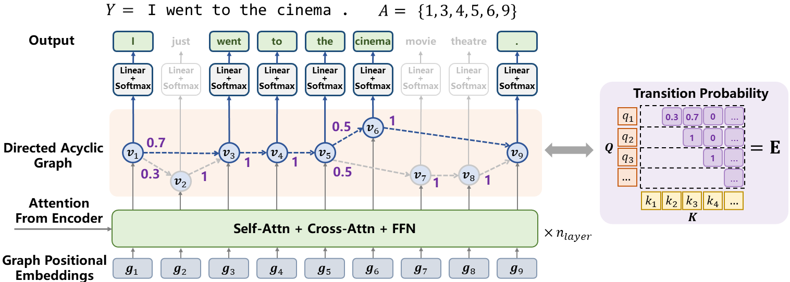

# DA-Transformer

Implementation for the ICML2022 paper "**Directed Acyclic Transformer for Non-Autoregressive Machine Translation**".

**Abstract**: Directed Acyclic Transformer (DA-Transformer) represents the hidden states in a Directed Acyclic Graph (DAG), where each path of the DAG corresponds to a specific translation. The whole DAG simultaneously captures multiple translations and facilitates fast predictions in a non-autoregressive fashion.

**Practical Advantages**: 

* DA-Transformer can be effectively trained **without Knowledge Distillation**
* DA-Transformer **outperforms strong baselines (GLAT+CTC) by 3 BLEU** when training on the raw data
* DA-Transformer achieve **competitive performance with the autoregressive Transformer**, while **preserving 7~14 times latency speedup in inference**





This repo is modified from [``fairseq:5175fd``](https://github.com/pytorch/fairseq/tree/5175fd5c267adceec9445bf067597686e159e7e7), please see [fairseq documentation](https://fairseq.readthedocs.io/en/latest/) for more information.

**Features**:

- We provide **cuda implementations** (enable by default) for dynamic programming and several other operations to improve the training speed and reduce GPU memory usage. If you do not want to use the custom cuda implementations, we also provide the functions implemented in PyTorch native operations.
- We support [LightSeq](https://github.com/bytedance/lightseq) to boost the training speed. (The speed up reported in the paper does not use LightSeq.)
- We provide a multi-thread C++ implementation for BeamSearch.

## Requirements & Installation

* Python >= 3.7
* Pytorch == 1.10.1
* ``git clone --recurse-submodules https://github.com/thu-coai/DA-Transformer.git && pip install -e .``
* (Optional) Customized LightSeq for NAT (``cd lightseq && pip install -e .``)
* (Optional) BeamSearch algorithm for DA-Transformer (``cd dag_search && bash install.sh``)

## Main Files

Most codes of the framework are from Fairseq. We mainly add the following files.

### fs_plugins

```
fs_plugins
├── criterions
│   └── nat_dag_loss.py                   # DA-Transformer loss
├── custom_ops                            # operations implementations and cuda kernels
│   ├── dag_best_alignment.cu
│   ├── logsoftmax_gather.cu
│   ├── dag_loss.cu
│   ├── dag_loss.py
│   └── dag_loss.cpp
├── models
│   ├── glat_decomposed_with_link.py      # A PyTorch implementation of DA-Transformer
│   ├── ls_glat_decomposed_with_link.py   # A lightseq implementation of DA-Transformer
│   └── ls_*                              # Other files required for lightseq
├── optimizer
│   └── ls_adam.py                        # Lightseq Adam
├── scripts
│   ├── test_tradeoff.py                  # Parameter search script used in BeamSearch
│   ├── average_checkpoints.py            # Average checkpoints tricks
|   └── convert_ls_to_fairseq.py          # Converting lightseq model to fairseq model
└── tasks
    └── translation_lev_modified.py
```

### Modified LightSeq for NAT

We include a customized [LightSeq](https://github.com/thu-coai/lightseq-nat/). The changes include:

* Implement the non-autoregressive decoder based on the LightSeq autoregressive decoder
* Increase the supported max length (1024 for now)
* Align the parameters and model architectures with Fairseq implementation, and provide a script for checkpoint conversion.

### BeamSearch on DAG

We include [dag_search](https://github.com/thu-coai/DAG-Search) to implement the BeamSearch algorithm.

## Data Preprocessing

Please follow the [instruction](https://github.com/facebookresearch/fairseq/tree/main/examples/translation#wmt14-english-to-german-convolutional) in Fairseq to prepare the data.

The training require binarized data generated by the following script:

```bash
input_dir=path/to/raw_data        # directory of raw text data
data_dir=path/to/binarized_data   # directory of the generated binarized data
src=en                            # source language id
tgt=de                            # target language id
fairseq-preprocess --source-lang ${src} --target-lang ${tgt} \
    --trainpref ${input_dir}/train --validpref ${input_dir}/valid --testpref ${input_dir}/test \
    --src-dict ${input_dir}/dict.${src}.txt --tgt-dict {input_dir}/dict.${tgt}.txt \
    --destdir ${data_dir} --workers 32
```

## Training

**We use a batch size of approximating 64k tokens, so the GPU number * max_tokens * update_freq should be 64k.**

For example, **if you have 8 V100-32 GPUs**, run the following script for training:

```bash
data_dir=/path/to/binarized/data/dir
checkpoint_dir=/path/to/checkpoint/dir

fairseq-train ${data_dir}  \
    --user-dir fs_plugins \
    \
    --task translation_lev_modified  --noise full_mask \
    \
    --arch glat_decomposed_link_base \
    --decoder-learned-pos --encoder-learned-pos \
    --share-all-embeddings --activation-fn gelu \
    --apply-bert-init \
    --links-feature feature:position --decode-strategy lookahead \
    --max-source-positions 128 --max-target-positions 1024 --src-upsample-scale 8.0 \
    \
    --criterion nat_dag_loss \
    --length-loss-factor 0 --max-transition-length 99999 \
    --glat-p 0.5:0.1@200k --glance-strategy number-random \
    \
    --optimizer adam --adam-betas '(0.9,0.999)' --fp16 \
    --label-smoothing 0.0 --weight-decay 0.01 --dropout 0.1 \
    --lr-scheduler inverse_sqrt  --warmup-updates 10000   \
    --clip-norm 0.1 --lr 0.0005 --warmup-init-lr '1e-07' --stop-min-lr '1e-09' \
    --ddp-backend c10d \
    \
    --max-tokens 4096  --update-freq 2 --grouped-shuffling \
    --max-update 300000 --max-tokens-valid 4096 \
    --save-interval 1  --save-interval-updates 10000  \
    --seed 0 \
    \
    --valid-subset valid \
    --validate-interval 1       --validate-interval-updates 10000 \
    --eval-bleu --eval-bleu-args '{"iter_decode_max_iter": 0, "iter_decode_with_beam": 1}' \
    --eval-bleu-detok space --eval-bleu-remove-bpe --eval-bleu-print-samples \
    --fixed-validation-seed 7 \
    --best-checkpoint-metric bleu --maximize-best-checkpoint-metric   \
    --keep-best-checkpoints 5 --save-dir ${checkpoint_dir} \
    --log-format 'simple' --log-interval 100
```

### Explanations of some arguments

```bash
--task translation_lev_modified   # Task for NATs
--optimizer adam                  # The optimizer. You can use "ls_adam" instead to enable LightSeq's Optimizer

--arch glat_decomposed_link_base  # The Model Architecture. You can use "ls_glat_decomposed_link_base" to enable LightSeq's Transformer
--links-feature feature:position  # Features used to predict links(transitions). We use transformer outputs with learnable positional embeddings
--max-transition-length 99999       # Max transition distance. -1 means no limitation, which does not support cuda operations. To use cuda operations with no limitation, please set a very large number such as 99999.
--src-upsample-scale 8.0          # The upsampling rate (\lambda), Graph Size = \lambda * src_length
--max-source-positions 128        # Max source length
--max-target-positions 1024       # Max target length (Should be equal to max_source_positions * \lambda)
--decode-strategy  lookahead      # Decoding Strategy. Possible values: greedy, lookahead, beamsearch.

--criterion nat_dag_loss          # The Criterion for DA-Transformer
--label-smoothing 0.0             # DA-Transformer does not use label smoothing for now
--length-loss-factor 0            # Disable the length predictor
--glat-p 0.5:0.1@200k             # Glancing probability. It indicates annealing p from 0.5 to 0.1 in 200k steps.
--glance-strategy number-random   # Glancing strategy. Possible values: "number-random" or "None" or "CMLM"
--torch-dag-loss                  # Use torch implementation for dag loss instead cuda implementation. It may become slower and consume more memory.
--torch-dag-best-alignment        # Use torch implementation for best-alignment instead cuda implementation. It may become slower and consume more memory.
--torch-dag-logsoftmax-gather     # Use torch implementation for logsoftmax-gather instead cuda implementation. It may become slower and consume more memory.
```

### Speed up with Lightseq

Only need to change two options:

* ``--arch glat_decomposed_link_base`` to ``--arch ls_glat_decomposed_link_base``
* ``--optimizer adam`` to ``--optimizer ls_adam``

Lightseq usually brings about 1.5x speed up in training.

**Note: Lightseq does not provide all Transformer variants in Fairseq.**
**If you want to change the model architecture, it may work inappropriately without any warnings. You must read the codes carefully before you make any changes.**

## Inference

DA-Transformer provides three decoding strategy:

* **Greedy**:  Fastest, use argmax in token prediction and transition prediction.
* **Lookahead**: Similar speed as Greedy, but higher quality. Consider transition prediction and token prediction together
* **BeamSearch**: Slowest but highest quality. Can combine with n-gram language model.

### Average Checkpoints

We average the parameters of the best 5 checkpoints, empirically leading to a better performance.

```bash
checkpoint_dir=/path/to/checkpoint/dir
average_checkpoint_path=/path/to/checkpoint/average.pt

python3 ./fs_plugins/scripts/average_checkpoints.py --inputs ${checkpoint_dir} \
                --max-metric --best-checkpoints-metric bleu --num-best-checkpoints-metric 5 --output ${average_checkpoint_path}
```

### Greedy & Lookahead

```bash
# Greedy
data_dir=/path/to/binarized/data/dir
average_checkpoint_path=/path/to/checkpoint/average.pt

fairseq-generate ${data_dir} \
    --gen-subset test --user-dir fs_plugins --task translation_lev_modified \
    --iter-decode-max-iter 0 --iter-decode-eos-penalty 0 --beam 1 \
    --remove-bpe --max-tokens 4096 --seed 0 \
    --model-overrides "{\"decode_strategy\":\"greedy\"}" \
    --path ${average_checkpoint_path}

# Lookahead
# ``decode_beta`` scales the score of logits. Specifically: y_i, a_i = argmax [ log P(y_i|a_i) + beta * log P(a_i|a_{i-1}) ]

fairseq-generate ${data_dir} \
    --gen-subset test --user-dir fs_plugins --task translation_lev_modified \
    --iter-decode-max-iter 0 --iter-decode-eos-penalty 0 --beam 1 \
    --remove-bpe --max-tokens 4096 --seed 0 \
    --model-overrides "{\"decode_strategy\":\"lookahead\",\"decode_beta\":1}" \
    --path ${average_checkpoint_path}
```

For WMT17 En-Zh, we add ``--source-lang en --target-lang zh --tokenizer moses --scoring sacrebleu --sacrebleu-tokenizer zh``.

**Note: the latency in our paper is evaluated with batch size of 1.  That is, replacing --max-tokens 4096 by --batch-size 1**

### BeamSearch

Please install dag_search first, see ``./dag_search/install.sh`` for requirements.

If you want to use n-gram LM in BeamSearch, see [this](dag_search/README.md) to build one before generation.

```bash
# OMP_NUM_THREADS sets the number of threads in inference.
# For batch_size = 1, the optimal number is 2. In most cases, do not use more than 8 (It will be slow due to resource conflicts.)

# The algorithm finds the sentence maximize: 1 / |Y|^{alpha} [ log P(Y) + gamma log P_{n-gram}(Y)]
# ``decode_beta`` scales the score of logits. Specifically: log P(Y, A) := sum P(y_i|a_i) + beta * sum log(a_i|a_{i-1})
# ``decode_alpha`` is used for length penalty. ``decode_gamma`` is used for the n-gram language model score.
# ``decode_lm_path`` is the path to the language model
# ``decode_beamsize`` is the beam size; ``decode_top_cand_n`` set the numbers of top candidates when considering transition
# ``decode_top_p`` set the max probability of top candidates when considering transition
# ``decode_max_beam_per_length`` limits the number of beam that has a same length in each step
# ``decode_max_batchsize`` should not be smaller than the real batch size (the value is used for memory allocation)
# ``dedup`` indicates token deduplication.

# BeamSearch without LM
data_dir=/path/to/binarized/data/dir
average_checkpoint_path=/path/to/checkpoint/average.pt
OMP_NUM_THREADS=8  # The cpu number used for beamsearch

fairseq-generate  ${data_dir} \
    --gen-subset test --user-dir fs_plugins --task translation_lev_modified \
    --iter-decode-max-iter 0 --iter-decode-eos-penalty 0 --beam 1 \
    --remove-bpe --batch-size 32 --seed 0 \
    --model-overrides "{\"decode_strategy\": \"beamsearch\", \"decode_beta\": 1, \
        \"decode_alpha\": 1.1, \"decode_gamma\": 0, \
        \"decode_lm_path\": None, \
        \"decode_beamsize\": 200, \"decode_top_cand_n\": 5, \"decode_top_p\": 0.9, \
        \"decode_max_beam_per_length\": 10, \"decode_max_batchsize\": 32, \"decode_dedup\": True}" \
    --path ${average_checkpoint_path}

# BeamSearch with LM
# You should first build the n-gram language model and save it to /path/to/ngram_lm.arpa
fairseq-generate ${data_dir} \
    --gen-subset test --user-dir fs_plugins --task translation_lev_modified \
    --iter-decode-max-iter 0 --iter-decode-eos-penalty 0 --beam 1 \
    --remove-bpe --batch-size 32 --seed 0 \
    --model-overrides "{\"decode_strategy\": \"beamsearch\", \"decode_beta\": 1, \
        \"decode_alpha\": 1.1, \"decode_gamma\": 0.1, \
        \"decode_lm_path\": \"/path/to/ngram_lm.arpa\", \
        \"decode_beamsize\": 200, \"decode_top_cand_n\": 5, \"decode_top_p\": 0.9, \
        \"decode_max_beam_per_length\": 10, \"decode_max_batchsize\": 32, \"decode_dedup\": True}" \
    --path ${average_checkpoint_path}
```

For WMT17 En-Zh, we add ``--source-lang en --target-lang zh --tokenizer moses --scoring sacrebleu --sacrebleu-tokenizer zh``.

**Note: We tune ``decode_alpha`` from 1 to 1.4 on the valid set to achieve maximum BLEU, and then apply it to the test set.** You can use ``./fs_plugins/scripts/test_tradeoff.py`` to search the optimal alpha.

**Note: the latency in our paper is evaluated with batch size of 1.  That is, replacing --batch-size 32 by --batch-size 1**

## Other Scripts

We provide a script to converting a LightSeq checkpoint to a Fairseq checkpoint:

```bash
python3 ./fs_plugins/scripts/convert_ls_to_fairseq.py --input path/to/ls_checkpoint.pt --output path/to/fairseq_checkpoint.pt --user_dir ./fs_plugins
```
## Citing

Please kindly cite us if you find this paper or codes useful.

```
@inproceedings{huang2022DATransformer,
  author = {Fei Huang and Hao Zhou and Yang Liu and Hang Li and Minlie Huang},
  title = {Directed Acyclic Transformer for Non-Autoregressive Machine Translation},
  booktitle = {Proceedings of the 39th International Conference on Machine Learning, {ICML} 2022},
  year = {2022}
}
```